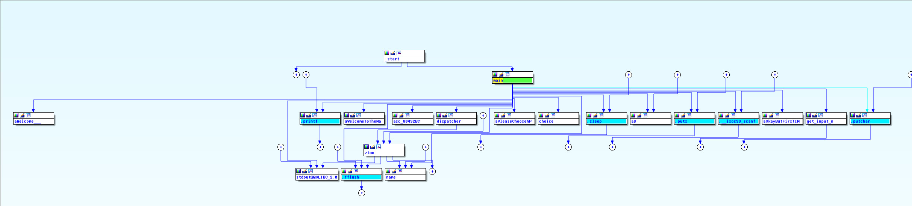

This writeup will show how the "Enter the Matrix" Challenge from the Backdoor CTF(https://backdoor.sdslabs.co/competitions/backdoorctf16/)  can be solved using angr (http://angr.io/).
Here is an example of what happens when you execute the program:
```
Welcome to the Matrix
---------------------

Please choose a pill:
1) Red pill
2) Blue pill
3) Exit

Choice:
2

Okay, but first, I must know your name:
Neo

Ah, so you would like to do some matrix multiplications instead?
Let's have it your way then...

Enter n (size of matrix): 8
Input matrix A:
1 2 3 4 5 6 7 8
1 2 3 4 5 6 7 8
1 2 3 4 5 6 7 8
1 2 3 4 5 6 7 8
1 2 3 4 5 6 7 8
1 2 3 4 5 6 7 8
1 2 3 4 5 6 7 8
1 2 3 4 5 6 7 8
Input matrix B:
1 2 3 4 5 6 7 8
1 2 3 4 5 6 7 8
1 2 3 4 5 6 7 8
1 2 3 4 5 6 7 8
1 2 3 4 5 6 7 8
1 2 3 4 5 6 7 8
1 2 3 4 5 6 7 8
1 2 3 4 5 6 7 8
Here is AxB:
     36      72     108     144     180     216     252     288 
     36      72     108     144     180     216     252     288 
     36      72     108     144     180     216     252     288 
     36      72     108     144     180     216     252     288 
     36      72     108     144     180     216     252     288 
     36      72     108     144     180     216     252     288 
     36      72     108     144     180     216     252     288 
     36      72     108     144     180     216     252     288 
```


